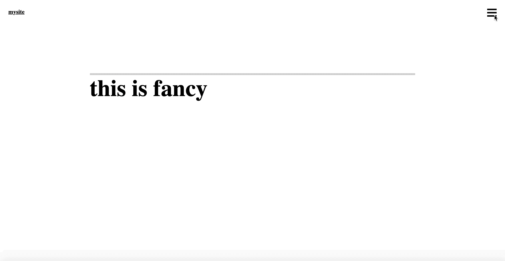

# css-effects-animated-menu

> **html nav, header, section** | **css import fonts.googleapis** | **transform: translateY** | **transform: scaleX(0)** | **transform-origin: right** | **float: right;** | **display: grid** | **grid-template-columns: repeat(4, 25%)** | **scss variables** | **animation @keyframes** | **&::before** | **content: ' '** | **JavaScript ('open-menu').addEventListener('click', () => overlay.classList.add('show-menu')** | **JavaScript ('close-menu').addEventListener('click', () => overlay.classList.remove('show-menu')** 

# Demo
